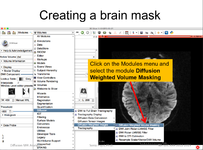
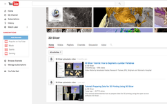

# What is 3D Slicer
3D Slicer is: 
* A software platform for the analysis (including registration and interactive segmentation) and visualization (including volume rendering) of medical images and for research in image guided therapy.
* A free, [open-source](http://en.wikipedia.org/wiki/Open_source) software available on multiple operating systems: Linux, MacOSX and Windows
* Extensible, with powerful [plug-in capabilities](developers/README.md) for adding algorithms and applications.
Features include:
* Multi organ: from head to toe.
* Support for multi-modality imaging including, MRI, CT, US, nuclear medicine, and microscopy.
* Bidirectional interface for devices.
There is no restriction on use, but Slicer is not approved for clinical use and intended for research. Permissions and compliance with applicable rules are the responsibility of the user. For details on the license see here

# Citing Slicer
To acknowledge 3D Slicer as a platform, please cite the Slicer web site (http://www.slicer.org) and the following publication: 
Fedorov A., Beichel R., Kalpathy-Cramer J., Finet J., Fillion-Robin J-C., Pujol S., Bauer C., Jennings D., Fennessy F., Sonka M., Buatti J., Aylward S.R., Miller J.V., Pieper S., Kikinis R. 3D Slicer as an Image Computing Platform for the Quantitative Imaging Network. Magnetic Resonance Imaging. 2012 Nov;30(9):1323-41. PMID: 22770690.

# Slicer Training
|  |  |
| ----| ---- |
|  | The [Slicer Training](training/README.md) page provides a series of updated tutorials and data sets for training in the use of Slicer. |
|  | [3D Slicer YouTube channel](https://www.youtube.com/channel/UC11x1iQ7ydSIFYw4L6wveXg?view_as=public) has been reorganized, new videos developed by the 3D Slicer community added to the channel
