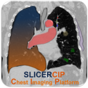
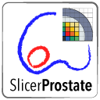
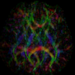
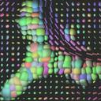
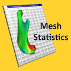
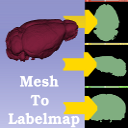
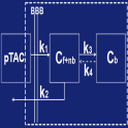
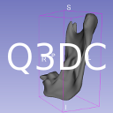
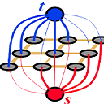

# Extensions
## Featured
| Extension | Description |
|-----------|-------------|
| | Toolkit for radiation therapy research. Features include DICOM-RT import/export, dose volume histogram, dose accumulation, external beam planning (TPS), structure comparison and morphology, isodose line/surface generation, etc.
| | This extension contains modules that enable rapid prototyping of applications for image-guided interventions. Modules are provided for tool calibration, patient registration, and real-time data collecion and processing from real-time imaging and/or tracking hardware through OpenIGTLink protocol.
| | The purpose of the Reporting module is to provide Slicer interface for creating image annotations/markup that are stored in a structured form, and can be exported into Annotation Image Markup (AIM) XML-based format.
| | A set of modules for reviewing and recording sequences of images, transforms, or any other nodes
| | Chest Imaging Platform is an extension for quantitative CT imaging biomarkers for lung diseases
||SlicerProstate extension hosts various modules to facilitate processing and management of prostate image data, utilizing prostate images in image-guided interventions and development of the imaging biomarkers of the prostate cancer

## Segmentation
| Extension | Description |
|-----------|-------------|
| | Atlas Based Classification
| | IntensitySegmenter is a simple tool that segments an image according to intensity value. It is mainly used to segment CT scans using the Hounsfield scale but the ranges of intensities and their corresponding labels can be specified in an input text file.
| | Pick 'n Paint tool allows users to select ROIs on a reference model and to propagate it over different time point models

## Diffusion tensor imaging
| Extension | Description |
|-----------|-------------|
| | This extension provides the tool DTIProcess integrated in Slicer
| | DTI-Reg is an extension that performs pair-wise DTI registration, using scalar FA map to drive the registration
| |This resamples Diffusion Tensor Images (DTI) in the log-euclidean framework

## Utilities
| Extension | Description |
|-----------|-------------|
| | Tools package for the cranio-maxillofacial registration
| | This is a module to generate a curve based on a list of fiducial points
| | Slicelet covering the gel dosimetry analysis workflow used in commissioning new radiation techniques and to validate the accuracy of radiation treatment by enabling visual comparison of the planned dose to the delivered dose, where correspondence between the two dose distributions is achieved using embedded landmarks. Gel dosimetry is based on imaging chemical systems spatially fixed in gelatin, which exhibit a detectable change upon irradiation.
| | This extension computes the distance between two 3D models
| | NeedleFinder: fast interactive needle detection. It provides interactive tools to segment needles in MR/CT images. It has been mostly tested on MRI from gynelogical brachytherapy cases. Cf <<Validation of Catheter Segmentation for MR-Guided Gynecologic Cancer Brachytherapy.>> MICCAI 2013
| | The PET DICOM Extension provides tools to import PET Standardized Uptake Value images from DICOM into Slicer.
| | The Percutaneous Approach Analysis is used to calculate and visualize the accessibility of liver tumor with a percutaneous approach.
| | Clip volumes with surface models and ROI boxes
| | A Module to connect to the TCIA archive, browse the collections, patients and studies and download DICOM files to 3D Slicer.
| | This Module is used to calculate the angle between two planes by using the normals
| | This Module is used to clip one or different 3D Models according to a predetermined plane
| | Computes margins for label maps
| | Mesh Statistics allows users to compute descriptive statistics over specific and predefined regions
| | This extension computes a label map from a 3D model
| | Multiparametric Image Review (mpReview) module is intended to support review and annotation of multi-parametric image data
| | The PET-IndiC Extension allows for fast segmentation of regions of interest and calculation of quantitative indices
| | First Version of the Pet Spect Analysis Extension
| | Tumor and lymph node segmentation in PET scans with a specialized Editor effect
| |Modules for quantitative 3D cephalometrics - head measurements used in craniofacial surgery
||Modules for cardiac analysis and intervention planning and guidance
||T1 mapping estimates effective tissue parameter maps (T1) from multi-spectral FLASH MRI scans with different flip angles

## Editor plugins
| Extension | Description |
|-----------|-------------|
| | This is a segment extension using graph cut and star shape algorithm
||A module to perform a series of ITK watershed segmentation (without seeds) and then let the user create a label map out of selected components

## For developers
| Extension | Description |
|-----------|-------------|
| | This extension contains various tools useful for developing and debugging modules
| | This extension offers different tools to help developers when they create Slicer extension
| | The Matlab Bridge extension allows running Matlab scripts as command-line interface (CLI) modules directly from 3D Slicer 

