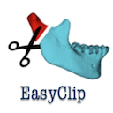

# Extensions
| Extension | Description |
|-----------|-------------|
| | This Module is used to calculate the angle between two planes by using the normals
| | Chest Imaging Platform is an extension for quantitative CT imaging biomarkers for lung diseases
| | DTI-Reg is an extension that performs pair-wise DTI registration, using scalar FA map to drive the registration
| | This Module is used to clip one or different 3D Models according to a predetermined plane
| | The Matlab Bridge extension allows running Matlab scripts as command-line interface (CLI) modules directly from 3D Slicer 
| | 
| | Mesh Statistics allows users to compute descriptive statistics over specific and predefined regions
| | This extension computes a label map from a 3D model
| | Multiparametric Image Review (mpReview) module is intended to support review and annotation of multi-parametric image data
| | The PET-IndiC Extension allows for fast segmentation of regions of interest and calculation of quantitative indices
| | First Version of the Pet Spect Analysis Extension
| | Tumor and lymph node segmentation in PET scans with a specialized Editor effect
| | Pick 'n Paint tool allows users to select ROIs on a reference model and to propagate it over different time point models
| |Modules for quantitative 3D cephalometrics - head measurements used in craniofacial surgery
| |Modules for quantitative 3D cephalometrics - head measurements used in craniofacial surgery

## Editor plugins
| Extension | Description |
|-----------|-------------|
| | This is a segment extension using graph cut and star shape algorithm

## For developers

| Extension | Description |
|-----------|-------------|
| | This extension contains various tools useful for developing and debugging modules
| | This extension offers different tools to help developers when they create Slicer extension

