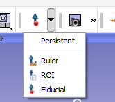
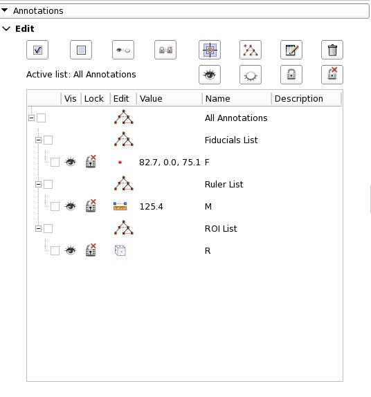
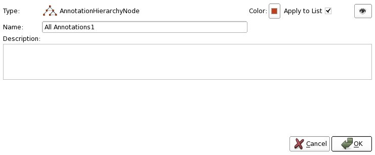
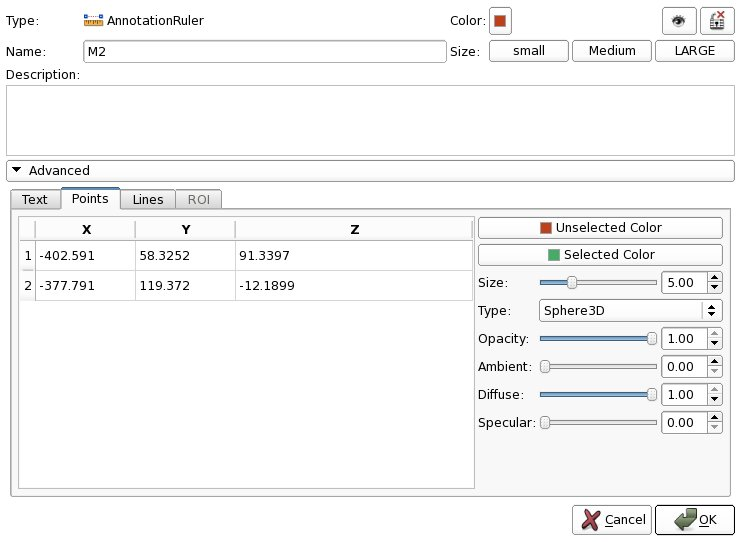

# Annotations module

Create and edit annotations, supplementary information associated with a scene. Currently supported annotations are rulers and regions of interest (ROIs). Use the Markups module for fiducials.

Most frequent use cases:
* Using rulers to measure tumor diameters
* Using ROIs to crop volume rendering

## Panels and their use

### Toolbar

The Annotations tool bar at the top of the main Slicer window is used to add new annotations to the scene.

* Create new annotations by selecting them from the drop down menu. Return to rotate mouse mode by clicking on the rotate icon.
* To place multiple annotations: click on the arrow-down button and then click on Persistent option.

### Annotations module main panel

* Annotation control buttons
  * Select all button: Select all annotations and hierarchies
  * Unselect all button: Unselect all annotations and hierarchies
  * Toggle visibility button: Toggle the visibility of highlighted Annotations. Hierarchies are ignored.
  * Lock selected button: Lock or unlock highlighted annotations. Hierarchies are ignored.
  * Jump slices button: Reset slice views to the first coordinate of the highlighted annotation.
  * Add hierarchy button: Create a new hierarchy. If a hierarchy is currently highlighted, the new one will be a sub-hierarchy
  * Generate report: Display a report of highlighted annotations
  * Delete selected button: Delete highlighted annotations. Hierarchies have to single selected to get deleted.
  * Active list: The name of the currently active list, which controls which list new annotations will be added to. If the top level All Annotations list is active, the module will automatically create separate lists for each type of annotation. Click on a hierarchy in the tree view to make it active and to add new annotations to it.
  * Show hierarchy button: Set all annotations in active list visible
  * Hide hierarchy button: Set all annotations in active list invisible
  * Lock hierarchy button: Set all annotations in active list locked
  * Unlock hierarchy button: Set all annotations in active list to be unlocked
* Annotation hierarchy tree
  * Selected: Selected annotations can be passed to command line modules.
  * Vis: Click on this button (eye open or closed) to toggle the visibility of the annotation in the 2D and 3D views
  * Lock: Click on this button to make the annotation be locked into place, not responding to mouse events. This is useful if you need to manipulate other things in the scene.
  * Edit: Click on the icon in the Edit column to bring up the Modify Annotation Properties dialog box
  * Value: A useful value associated with the annotation (length for rulers)
  * Name: The name of the annotation, usually kept short, one letter and a number, as it's displayed in the 3D and 2D windows.
  * Description: A longer text describing this annotation

Tips:
* To delete multiple annotations from a list press down the Control key and left click to select annotations in the Annotations GUI, then click on the trash can to delete them.
* To move multiple annotations from one list to another, hold down the Shift key and left click to select a group of annotations, then while still holding down the shift key, left click on the selection to drag and drop it.
* To access Annotation Properties or Hierarchy Properties, click on the logo under Edit in the annotation table.

### Annotation hierarchy properties

* Type: The class types for this annotation hierarchy
* Color: Click on this button to bring up a color picker widget to set the color used for all annotations in this hierarchy when the hierarchy is collapsed.
* Apply to List: If this checkbox is ticked, change the color on all the annotations in this hierarchy. Default true.
* Visibility: Click on this button (eye open or closed) to toggle the visibility of the annotations in this hierarchy in the 2D and 3D views.
* Name: The name of the annotation hierarchy, describing the annotations below it.
* Description: A longer text describing this annotation hierarchy
* List Text Scale: Set the annotation text scale for all annotations in this hierarchy. This slider is not initialized from the current annotation text scales but from the default text scale for a single annotation. Use the Default button to reset to this default value.
* List Glyph Scale: Set the annotation glyph scale for all annotations in this hierarchy. This slider is not initialized from the current annotation glyph scales but from the default glyph scale for a single annotation. Use the Default button to reset to this default value.
* List Glyph Type: Set the annotation glyph type for all annotations in this hierarchy. This menu is not initialized from the current annotation glyph types but from the default glyph type for a single annotation. Use the Default button to reset to this default value.

### Annotation properties

* Type: The class type for this annotation. For example, a ruler or a region of interest.
* Color: Click on this button to bring up a color picker widget to set the color for all parts of the annotation (text, glyphs, lines)
* Visibility: Click on this button (eye open or closed) to toggle the visibility of the annotation in the 2D and 3D views.
* Lock: Click on this button to make the annotation be locked into place, not responding to mouse events. This is useful if you need to manipulate other things in the scene.
* Name: The name of the annotation, usually kept short, one letter and a number, as it's displayed in the 3D and 2D windows.
* Size: Click on the Small, Medium, Large buttons to change the scaling of the annotation
* RAS: The world coordinates of this annotation in the default Slicer Right-Anterior-Superior coordinate system. Double click to edit the values
* Description: A longer text describing this annotation
* Advanced
  * Text: Set the descriptive text, text color, scale, opacity on this panel
  * Points: Set the coordinate location of the point(s), glyph color, scale, glyph type, opacity, ambient, diffuse, specular material properites on this panel
  * Lines: This panel is only enabled for rulers. Set the line color, label visibility, label position along the line (from 0-1), tick spacing, maximum number of ticks, opacity, ambient, diffuse, specular material properites on this panel
  * ROI: This panel is only enabled for regions of interest. Set the ranges for the ROI along it's axes, LR, PA, IS. Toggle the ROI visibility and if it's updated interactively on this panel

## More information

* [Developer information](../../developers/annotations/README.md)

## Contributors

* Author(s)/Contributor(s): Nicole Aucoin (SPL, BWH), Kilian Pohl (UPenn), Daniel Haehn (UPenn), Yong Zhang (BWH), Alex Yarmarkovich (Isomics), Wendy Plesniak (SPL, BWH)
* Contact: Nicole Aucoin, nicole@bwh.harvard.edu

## Acknowledgements

The research was funded by an ARRA supplement to NIH NCRR (P41 RR13218). This work is part of the National Alliance for Medical Image Computing (NAMIC), funded by the National Institutes of Health through the NIH Roadmap for Medical Research, Grant U54 EB005149.

|  |  |  |
| ---------------- | ---------------- | ---------------- | ---------------- |
| Surgical Planning Laboratory | National Alliance for Medical Image Computing (NA-MIC) | Neuroimage Analysis Center (NAC) |
