# Overview

This is a module for manual segmentation of volumes. Segmentations (also known as contouring) delineate structures of interest. Some of the tools mimic a painting interface like photoshop or gimp, but work on 3D arrays of voxels rather than on 2D pixels. 
This module is used for manipulating label map volumes. Each of the slice viewers can be operated on independently, although typically the same background and label layer will be used in all slice views. Whichever label map volume is selected in the label layer will be the target for each of the editor effects. Any scalar volume can be used as the background layer. For example, you may wish to create a label map volume based on a high resolution structural scan, and then edit while looking at a lower resolution diffusion scan.

**Terminology**
* **Label Map Volume** is a 3D scalar volume node where each voxel is a number indicating the type of tissue at that location. A label volume is associated with a Color Node that maps the numbers into colors and text strings
* **Slice Viewer** refers the Red, Yellow, and Green windows that display volume slices on the slicer interface.
* **Effect** refers to any of the editor tools in the editor tool box.
* **Labeler** is a type of effect that modifies the existing label map; labelers have a common set of controls options.

# Use Cases

The overall goal is to allow users to efficiently and precisely define structures within their volumes as label map volumes.  These label maps can be used for:
* Surgical/radiation therapy planning
* Intra-surgery navigation
* Volume/shape analysis
* 3D printing
* Further processing (using, for example, the [Label Statistics](../label_statistics/README.md) module

The label maps can either be defined from within the Editor module itself, or you can use the output of other modules and the basis for editing.

# Tutorials

The [training](../../training/README.md) page provides several use cases that rely on Editor functionality.

# Panels and their use

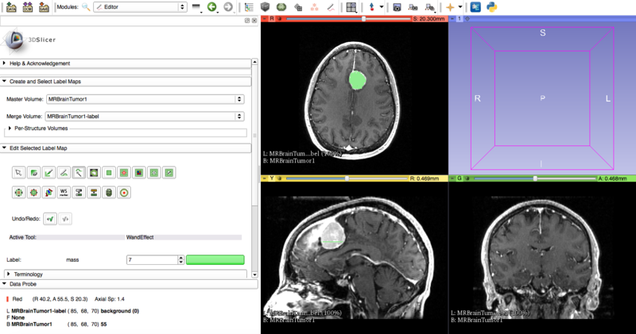

## Single Label Map

A typical straightforward Editor workflow for consists of the following steps:
* Load a volume.
* Enter the Editor module using either the toolbar or the Modules menu button.
* You will be prompted to select a color table to use for editing (see Color Table Dialog image).

  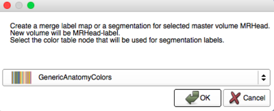
 * Pick a color node that contains the structures you wish to create.  If there are no appropriate tables available, you can create custom nodes in the [Colors module](../colors/README.md).
* Clicking apply in the Color Table Dialog will create a new label map volume based on the background volume in the Red slice view at the time you entered the Editor.  It will be the same dimensions, orientation, and spacing as the background volume.  But it will be initialized to all zeros and it will have the 'Label Map' property set.  (You can look at these in the "Info" tab of the [Volumes module](../volumes/README.md).
 * If your background was named *t1* the label will be called *t1-label*.
* When label map volume is selected, the edit tools frame will automatically expand and you can use the Editor Effects to define your structures.

* **Note** that if you already have a label map volume as the result of a previous editing step it will be automatically selected when you enter the Editor (i.e. after using some other [segmentation modules](../../training/segmentation/segmentation-modules.md) you will be set up to perform manual edits of the selected label map).  You can use the Set option to pick this label map instead of the default.
* **Note** that the background and label map settings in the Red slice viewer are used to determine the volumes to edit.  In the Editor Module the background grayscale volume is known as the "Master Volume" because it is used as input to tools such as Threshold Paint.  The map is known as the "Merge Volume" because it contains multiple structures (see below for information about splitting and re-merging the Merge Volume to edit individual structures).

## Per-Structure Volumes

*Please familiarize yourself with the Single Label Map approach before attempting to use the Multiple Label Map tools*

This approach can be used to independently work with a single structure using tools, like the Threshold effect, that operate on the entire volume.  To access this functionality, open the Per-Structure Volumes interface by clicking on the downward pointing triangle on the right side of the box.

* Start with a Merge Volume that will contain all the structures of interest.
 * If you have already started defining the individual structures with different label values in the editor, or if you used something like Otsu Segmentation to generate a label map, then you can use the Split Merge Volume button to create a new volume for each unique label value in the Merge Volume.
  * If you are starting from scratch, you can use the Add Structure button to define new label volumes.  
    * Add Structure will prompt you for a label value based on the Color Table selected when the Merge Volume was created.
    * The new Structure Volume will be selected for editing.
* You can click in the Per-Structure Volumes list box to select the current label map for editing (so that you can easily toggle between the Structure Volumes).
* After defining the individual structures, you can use the Merge All button to put the volumes back into the Merge Volume.
  * *Hint*: If the structures overlap, you can use the Order column to define the priority of the structures during the merge process.'' 
* Use Merge And Build to create a set of modules from the merged volume.
  * This uses the Joint Smoothing option of the [Model Maker module](../model_maker/README.md) to create watertight models.
  * ''Hint: you can use the Model Maker module to manipulate other building parameters.'' 
* The Delete Structures button will remove the Per-Structure Volumes from your scene.  If you want to delete a single volume, use the [Data module](../data/README.md).

If you have the [Reporting extension](../../extensions/README.md) installed, you can export the stuctures to DICOM Segmentation (SEG) format, and will appear as a series for the corresponding study in the [DICOM module](../dicom/README.md).

# Effects

Effects operate either by clicking the Apply button in the GUI or by clicking and/or dragging in the slice view.  For operations where you use the GUI, the target label map is the one in the Red slice viewer.  Otherwise the target is based on which slice viewer you click in.
To use, select the label value for the tools to work on. Clicking on the colored box will provide a pop-up with a selection of labels.

## Paint 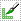

* Pick the radius (in millimeters) of the brush to apply
* Left click to apply single circle
* Left click and drag to draw a curve
* A trace of circles is left which are applied when the mouse button is released
* Sphere mode applies the radius to slices above and below the current slice.

The 'smudge' option can be used when working on the boundary between two or more regions.

## Draw 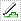

* Left click to lay individual points of an outline
* Left drag to lay down a continuous line of points
* 'x' key to delete the last point added
* Right click or 'a' key to apply segment

## Wand  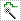

Click to fill connected regions with similar intensities and click multiple times to grow the region. The tolerance option controls how similar adjacent pixels must be in order to be filled.
* Max pixels per click determines how quickly the region is filled
* Fill Volume option allows for 3D segmentation

## Rectangle 
* Left click to start rubber band rectangle
* Release button to apply

## Level Tracing 

* Moving the mouse defines an outline where the pixels all have the same background value as the current background pixel
* Clicking the left mouse button applies that outline to the label map

## Identify Islands 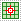

Use this tool to create a unique label value for each connected region in the current label map.  
Connected regions are defined as groups of pixels which touch each other but are surrounded by zero valued voxels. If FullyConnected is selected, then only voxels that share a face are counted as connected; if unselected, then voxels that touch at an edge or a corner are considered connected.

'''Note:''' Be aware that all non-zero label values labels values are considered equal by this filter and that the result will renumber the resulting islands in order of size.
'''Note:''' The output label values use the currently selected color table, but the names assigned to islands are arbitrary.  Label values are assigned in order of the size of the island starting with 1.  The value of 0 is assigned to the background.

## Change Island 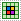

Changes color of an island, where an Island is a group of connected pixels with the same label. This does not change other voxels with the same label. This tool is useful after thresholding, to separate anatomy further.
* Click Change Island
* Click New Label and select a color, or enter a color number
* Click any part of the island
* Pixels that are part of that island will receive the New Label value

## Remove Islands 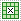

Automatically removes unlabelled voxels within a region.

* Useful for removing small areas of noise inside a surrounding thresholded area
* Two modes are supported:
  * Connectivity mode removes unsegmented islands that are completely enclosed with segmentation
  * Morphology mode removes small regions in and out of the segmentation even if they are partly connected to the larger regions.

## Save Island 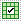
Save Island retains the selected island, and removes disconnected pixels with the same label. This is another way to clean up the results of a thresholding operation. This is useful for separating a single connected structure from other structures.

## Erode and Dilate 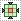 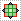
 
Add or remove a single layer of pixels from the current label value

## Change Label 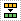

Changes every voxel in the target label map with the input value to the output value

## Undo/Redo  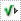

* The Editor can save state before each effect is applied.  This is useful for experimentation and error correction.  Prior to version 3.6.2 this can be somewhat slow and very memory hungry when working with large volumes so it is disabled by default.  As of version 3.6.2 the save operation is lightweight and is enabled by default for up to 100 steps.
* When enabled the buttons can be used to move forward and back through the volume checkpoints.
* Note that for some volumes storing the Undo buffer can fail (e.g. due to lack of memory).  In this case the undo/redo operations will fail to operate.

## Model maker 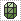

* A simple interface to of the full CLI module (See [[Documentation/{{documentation/version}}/Modules/ModelMaker|Model Maker Documentation]])
* The currently selected label number will be used to build.
* Select smooth model for more pleasing results
* Just click apply and models of all label maps will be created.
* Model building runs in the background and the model appears in the 3D view when finished.

## GrowCutSegment 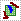

GrowCut is a powerful algorithm that uses example segmentation to create a full segmentation of the volume.  You can use multiple label colors to define regions that represent parts of anatomical structures and then let the GrowCut algorithm seek out a best labeling for adjacent pixel so they match your example.

To use this, you first define your example segmentation using the normal paint or draw tools as described above.  Define at least two structure classes and then click Apply.  If you are not satisfied with the result, use the Undo button to go back and modify your example. 

See the [Grow Cut module documentation]({{book.slicerWikiUrl}}/Modules//GrowCutSegmentation) for more details.

Also see the [Fast GrowCut module documentation]({{book.slicerWikiUrl}}/Modules/FastGrowCut). This is an effect that can be added by downloading the extension. It requires memory but is a fast implementation of the GrowCut method.

## WatershedFromMarkers 

Watershed From Markers a multi-label segmentation tool which has similar behavior to the GrowCuts algorithm. As input, it expects the current label map to be multiple labels or markers defining different objects. By applying the algorithm, the labels are greedily grown with the minimal gradient value. Objects with well defined edges are desirable for good segmentations with this method.

See the [[Documentation/{{documentation/version}}/Modules/Editor/WatershedFromMarkers| WatershedFromMarkers ]] page for more details.

## FastMarching 

FastMarching is a statistics-based region growing 3D segmentation algorithm. Paint to define seed voxels (one color only). Push "March" button to initiate region growing. Use the marching slider to interactively examine the front propagation history and choose the result you like.

## Labeler Effects

The following options work for all labelers (draw, paint, level tracing...)

### Threshold Painting and Drawing

* Use Threshold to determine a threshold range and click on Use for Paint
* Change into Paint or Draw and click on the Threshold button
* begin painting/drawing

Only voxels where the background value is within the threshold range will be set to the new label value.  The range is inclusive, so for example if the minimum is zero to ten, all pixels zero and above but less than or equal to ten will be included.

### Paint Over

When enabled, the labels are set to the new value no matter what their previous value was.

When disabled, only 0 (black/transparent) voxels are set to the new value.  Non-zero values are not changed.

# Keystrokes

The following keyboard shortcuts are active when you are in the Editor module.  They do not require a modifier key (no Control or Alt required) and they are intended to allow two-handed editing, where on hand is on the mouse and the other hand uses the keyboard to switch modes.

## Movement

* '''f''' - move to next slice
* '''b''' - move to previous slice
* '''Shift''' - scroll other slices to mouse location
* '''h''' - toggle the crosshair and put it into navigator mode

## Label Values (Colors)

* '''e''' - toggles from the current color to 0 and back (use this while painting or drawing to quickly erase if you go over the line)
* '''c''' - show color picker

## Segmentation Control

* '''z''' - undo
* '''y''' - redo

## Display

* '''o''' - toggle outline mode for label display
* '''g''' - toggle label opacity
* '''t''' - swap foreground and background volumes

## Effect Selection

* '''Escape''' - cancel current effect
* '''p''' - select Paint effect
* '''d''' - select Draw effect
* '''w''' - select Wand effect
* '''r''' - select Rectangle effect
* '''Space''' bring up tool selection window at current mouse location

## Label Keystrokes

Label Keystrokes are active for any effect that applies the current label color, such as Paint, Draw, or Wand.
* '''\''' (backslash key) - "eye dropper" to pick up the current paint color under the cursor (note the slice view must have 'focus', which means you must have clicked in the slice view once before the eye dropper will work correctly)

### Draw Effect Keystrokes

* '''a''' or '''Enter''' - apply the current outline 
* '''x''' - delete last point added 

### Paint Effect Keystrokes

* '''-''' or '''_''' - shrink the current radius by 20%
* '''+''' or '''=''' - grow the current radius by 20%

# Hints

[[Image:Selection 139.png|thumb|400px|right|Use of the Label Outline feature (below) vs the default view (above).  Note that the label outlines appear faint in the lower image -- zoom in by clicking on the image to see them as they actually appear in Slicer.]]
* You can use the [Image Label Combine](../image-label-combine/README.md) module to make a composite label map from two independent input label maps.  Sometimes it will make sense to have a separate label map for each anatomical structure and then combine them after editing.  In other cases it makes sense to put all structures into the same label map so that you can use the Paint Over option to make clean interfaces between the structures.
* The [Model Maker module](../model-maker/README.md) can automatically make models for all non-zero values in the label map.  The option for Joint Smoothing creates a 'water tight' set of models.  If you build the models independently the smoothing will cause gaps between the models.
* A large radius paint brush with threshold painting is often a very fast way to segment anatomy that is consistently brighter or darker than the surrounding region, but partially connected to similar nearby structures (this happens a lot).
* Use the slice viewer menus to control the label map opacity and display mode (to show outlines only or full volume).

# Limitations

* Threshold will not work with non-scalar volume background volumes.
* Mouse wheel can be used to move slice through volume, but on some platforms (mac) it may move more than one slice at a time.

# Similar Modules

* [Segment Editor](../segment-editor/README.md) is a completely reworked version of the Editor module. It is still evolving, but eventually it will replace the Editor module. 

# References

[[Slicer_3.6:Training |Training materials and tutorials from earlier versions of slicer]] may help give ideas about how to use these tools.

The GrowCut algorithm is presented here: 
V. Vezhnevets and V. Konouchine, "GrowCut - Interactive multi-label N-D image segmentation", in Proc. Graphicon, 2005. pp. 150--156.

FastMarching algorithm is available here:
Pichon E, Tannenbaum A, Kikinis R. A statistically based flow for image segmentation. Medical Image Analysis. 2004 September;8(3):267–274. http://www.spl.harvard.edu/publications/item/view/193

# Information for Developers

See the [step-by-step guide to writing an Editor Extension](../../developers/editor-extension.md).

# Contributors

* Author(s)/Contributor(s): Steve Pieper (Isomics Inc.), Wendy Plesniak (SPL, BWH), Ron Kikinis (SPL, BWH), Jim Miller (GE)
* Contact: Steve Pieper, pieper@bwh.harvard.edu

# Acknowledgements

This work is part of the [http://www.na-mic.org/ National Alliance for Medical Image Computing] (NA-MIC), funded by the National Institutes of Health through the NIH Roadmap for Medical Research, Grant U54 EB005149.

|  | | |  |
| ---------------- | ---------------- | ---------------- | ---------------- |
| Isomics, Inc. | National Alliance for Medical Image Computing (NA-MIC) | Neuroimage Analysis Center (NAC) | GE Global Research |
